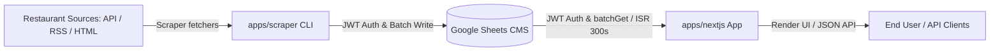

# AI Agent Guide (AGENTS.md)

This document provides context, architecture details, conventions, and operational workflows for AI coding agents (and human developers) working in the **Yle Campus Lunch List** repository.

---

## 1. Project Overview

**Yle Campus Lunch List** (`yle-campus-lunch-list`) is a monorepo application that aggregates, normalizes, and displays daily lunch menus from campus restaurants around Yleisradio (Huoltamo, Piccolo, Iso Paja, Studio 10, Pasilan Linkki, Päättäri, Akseli, Dylan Luft, Dylan Böle) in Helsinki, Finland.

### Key Characteristics
- **Headless CMS / Data Store**: Google Sheets API acts as the data store.
- **Scraper Service**: Standalone CLI pipeline that fetches restaurant menus from diverse sources (JSON APIs, Cheerio HTML parsing, RSS XML feeds) and synchronizes them into restaurant-specific tabs in Google Sheets.
- **Frontend App**: Next.js App Router web application with Tailwind CSS, deployed on Vercel, reading menus from Google Sheets using Incremental Static Regeneration (ISR).
- **Timezone**: All menu dates and weekday calculations are based on `Europe/Helsinki` (`UTC+2` / `UTC+3`).

---

## 2. Monorepo Architecture & Workspaces

The repository is managed with **Turborepo** and **pnpm** workspaces. All internal workspace packages are scoped under `@acme/*`.

| Workspace / Directory | Package Name | Responsibility |
| --- | --- | --- |
| `apps/nextjs` | `@acme/nextjs` | Next.js App Router frontend dashboard and legacy `/api/current-day-menus` endpoint |
| `apps/scraper` | `@acme/scraper` | Node.js CLI pipeline, restaurant fetchers (API/HTML/RSS), and Google Sheets sync |
| `packages/shared-types` | `@acme/shared-types` | Shared TypeScript domain models and interfaces (`MenuItem`, `Restaurant`, etc.) |
| `tooling/eslint` | `@acme/eslint-config` | Shared ESLint 9 flat configurations |
| `tooling/prettier` | `@acme/prettier-config` | Shared Prettier configuration with Tailwind & import sorting plugins |
| `tooling/tailwind` | `@acme/tailwind-config` | Shared Tailwind CSS v4 presets and theme styles |
| `tooling/typescript` | `@acme/tsconfig` | Shared `tsconfig.json` bases |

Other key directories:
- `docs/`: Data payload fixtures (`.html`, `.xml`, `.json`) and specifications used for tests.
- `.github/workflows/`: CI PR checks (`ci.yml`) and Docker publishing workflow (`docker-scraper.yml`).


---

## 3. Technology Stack & Key Dependencies

| Layer | Technologies / Libraries |
| --- | --- |
| **Package Manager** | `pnpm` 10.19.0 (with pnpm catalogs for React 19, TS, ESLint, Tailwind) |
| **Monorepo Engine** | `turbo` 2.5.8 |
| **Language & Runtime**| Node.js `24.x` (ESM modules), TypeScript `^5.9.3` |
| **Frontend Framework**| `next` ^16.0.9, `react` 19.1.4, `react-dom` 19.1.4 |
| **Styling** | `tailwindcss` ^4.1.16, `@radix-ui` primitives, `class-variance-authority`, `sonner` |
| **Env Validation** | `@t3-oss/env-nextjs`, `zod` |
| **Data Ingestion** | `googleapis` ^144.0.0, `cheerio` ^1.0.0, native `fetch` |
| **Test Runner** | Node.js native test runner via `tsx --test` |
| **Linting & Formatting**| ESLint 9 (flat config), Prettier with sort-imports and tailwindcss plugins, Sherif monorepo linter |

---

## 4. Data Flow & Google Sheets Schema



### Google Sheets Tab Structure
Each restaurant has its own tab titled with its unique `restaurantId` (e.g. `iso-paja`, `huoltamo`, `akseli`).
Columns (Row 1 headers, Rows 2+ data):
1. **A**: `restaurantId` (e.g. `iso-paja`)
2. **B**: `restaurantName` (e.g. `Iso Paja`)
3. **C**: `date` (ISO `YYYY-MM-DD`, e.g. `2026-08-23`)
4. **D**: `item` (dish description text)
5. **E**: `dietaryFlags` (comma-separated, e.g. `G, L, M`)
6. **F**: `lastUpdated` (ISO timestamp, e.g. `2026-08-23T10:15:00.000Z`)

---

## 5. Environment Variables & Configuration

The project reads variables from root `.env` (or `.env.local` / `.env.development`).

### Variable Reference

| Variable | Description | Required In |
| --- | --- | --- |
| `GOOGLE_SHEETS_ID` | Production Google Spreadsheet ID | Production (Frontend & Scraper) |
| `GOOGLE_SHEETS_URL` | Optional alternative to `GOOGLE_SHEETS_ID` (accepts full spreadsheet URL) | Optional |
| `DEV_GOOGLE_SHEETS_URL` | Dev Google Sheets URL (used when `NODE_ENV !== "production"`) | Local Development |
| `DEV_GOOGLE_SHEETS_ID` | Dev Google Sheets ID (used when `NODE_ENV !== "production"`) | Local Development |
| `GOOGLE_SERVICE_ACCOUNT_EMAIL` | Google Cloud Service Account email | Frontend & Scraper |
| `GOOGLE_PRIVATE_KEY` | Google Cloud Service Account private RSA key (escaped `\n` supported) | Frontend & Scraper |
| `HUOLTAMO_API_URL` | Yle Intra Apps Script JSON API URL for Huoltamo, Piccolo, Studio 10 | Scraper |
| `ISO_PAJA_URL` | Website URL for Iso Paja scraping | Scraper |
| `AKSELI_URL` | Website URL for Akseli scraping | Scraper |
| `PAATTARI_URL` | Website URL for Päättäri scraping | Scraper |
| `TARGET_DATE` / `DATE` / `SCRAPE_DATE` | Optional date override (`YYYY-MM-DD`) | Scraper |

> **Dev vs. Prod Sheet Resolution**: In non-production environments (`NODE_ENV !== "production"`), both the frontend and scraper automatically prioritize `DEV_GOOGLE_SHEETS_URL` / `DEV_GOOGLE_SHEETS_ID` if defined.

---

## 6. Development Commands & Workflows

Run all commands from the repository root:

### Common Tasks
```bash
# Install dependencies
pnpm install

# Start full development environment (Next.js + Scraper watch mode)
pnpm dev

# Start only the Next.js frontend
pnpm dev:next

# Run Scraper once (defaults to today's date in Europe/Helsinki)
pnpm dev:scraper

# Run Scraper for a specific target date
pnpm --filter @acme/scraper dev -- --date 2026-08-24
```

### Verification & Quality Checks
```bash
# Type check all packages
pnpm typecheck

# Lint with ESLint
pnpm lint

# Fix ESLint issues
pnpm lint:fix

# Check monorepo dependencies consistency (Sherif)
pnpm lint:ws

# Check code formatting with Prettier
pnpm format

# Auto-format all code
pnpm format:fix

# Run scraper unit tests
pnpm test
# Or target scraper specifically:
pnpm --filter @acme/scraper test
```

### Production Build & Local Preview
```bash
# Build all apps and packages
pnpm build

# Run production Next.js build locally
pnpm --filter @acme/nextjs start
```

---

## 7. How-To Guide: Adding or Modifying a Restaurant

When modifying an existing restaurant scraper or adding a new campus restaurant, follow this step-by-step checklist:

### Step 1: Create or update fetcher in `apps/scraper/src/fetchers/`
- Implement a parser function returning `Promise<ParsedMenuItem[]>`.
- Standardize dietary flags (`G`, `L`, `M`, `VEG`, `VL`, etc.) into an array of uppercase strings.
- Create or update a corresponding unit test file (e.g. `fetchers/restaurant-name.test.ts`) using sample HTML/JSON/XML data fixtures placed in `docs/`.

### Step 2: Register in `apps/scraper/src/index.ts`
- Export constant `RESTAURANT_ID` (kebab-case, e.g. `my-restaurant`) and `RESTAURANT_NAME` (e.g. `My Restaurant`).
- Call the fetcher within a `try/catch` block inside `main()`.
- Call `await updateGoogleSheet(RESTAURANT_ID, RESTAURANT_NAME, menus, targetDate)`.

### Step 3: Register in Next.js frontend configuration
- Add the restaurant to `RESTAURANT_CONFIGS` in `apps/nextjs/src/config/restaurants.ts`:
  ```typescript
  {
    id: "my-restaurant",
    name: "My Restaurant",
    websiteUrl: "https://...",
  }
  ```
- Adjust array ordering to position the restaurant in the UI.

### Step 4: Update environment configuration (if applicable)
- Add new source URLs to `.env.example`.
- Add new variable keys to `turbo.json` under `globalEnv`.

### Step 5: Test and verify
```bash
pnpm --filter @acme/scraper test
pnpm typecheck
pnpm lint
```

---

## 8. Client Code Conventions & Frontend Architecture

The Next.js frontend (`apps/nextjs`) follows strict principles for component reusability, modularity, and maintainability:

### 1. Atomic Design Hierarchy
Structure UI components following Atomic Design principles to maintain modularity and clear separation of concerns:
- **Atoms** (`src/components/ui/`): Fundamental, context-agnostic building blocks (e.g. `button.tsx`, `dropdown-menu.tsx`, theme toggles, icons, raw badges).
- **Molecules** (`src/components/`): Small combinations of atoms functioning together as a focused unit (e.g. `restaurant-menu-item.tsx`, dietary badge clusters, modal trigger buttons).
- **Organisms** (`src/components/`): Distinct, higher-level interface sections composed of molecules and atoms (e.g. `restaurant-view.tsx`, `restaurant-list-item.tsx`, `edit-restaurants-modal.tsx`, `footer.tsx`).
- **Templates & Pages** (`src/app/`): Page layouts and route views that assemble organisms and bind them to route parameters and server data (e.g. `app/page.tsx`, `app/restaurant/[id]/page.tsx`, `app/layout.tsx`).

### 2. DRY (Don't Repeat Yourself)
- **Shared Domain Utilities**: Centralize repeated calculations, date transformations, dietary flag formatters, and preference persistence in `src/lib/` (`dates.ts`, `sheets.ts`, `preferences.ts`, `utils.ts`) or `@acme/shared-types`.
- **Single Source of Truth**: Keep restaurant definitions and ordering metadata in `src/config/restaurants.ts` rather than hardcoding names or IDs across different UI views.
- **Consistent Prop Interfaces**: Reuse shared TypeScript interfaces (`MenuItem`, `Restaurant`, `DailyMenu`) from `@acme/shared-types` instead of defining ad-hoc inline prop shapes.

### 3. Pure & Functional Components
- **Functional Purity**: Design components to be deterministic functions of their props whenever possible. Given the same inputs, they should render the same JSX without causing unintended side effects during render.
- **Immutability**: Avoid mutating props or state directly; use functional array/object updates (`map`, `filter`, spread operators).
- **State Localization & Separation of Concerns**: Keep components presentational by default. Separate UI rendering from side effects or data fetching. Lift state up only to the closest common ancestor or manage through specialized hooks.

### 4. Server Components First
- **Default to React Server Components (RSC)**: Keep pages, layouts, and data fetchers on the server for performance, smaller client bundles, and SEO.
- **Isolate Client Boundaries**: Push `"use client"` down to the smallest possible leaf components that require interactivity (e.g. event handlers, React hooks, `localStorage` preferences in `edit-restaurants-modal.tsx`).

---

## 9. Testing Conventions & Strategy

### 1. Colocation
- **Same Directory**: Always colocate test files directly next to the module, utility, or component they are testing (e.g. `src/fetchers/akseli.ts` -> `src/fetchers/akseli.test.ts`, `src/lib/dates.ts` -> `src/lib/dates.test.ts`, `src/components/restaurant-menu-item.tsx` -> `src/components/restaurant-menu-item.test.tsx`).
- Do not create separate top-level `tests/` or `__tests__/` directories for unit tests.

### 2. Core Functionality & Minimal Footprint
- **Focus on Core Logic**: Unit tests should strictly focus on core business logic, parsing accuracy, edge cases (e.g. malformed markup, empty responses, date boundaries), and data transformations.
- **Keep Tests Minimal**: Keep unit tests as lean and minimal as possible. Avoid testing trivial pass-throughs, framework wiring, or passive presentational markup that carries no logic.
- **Data Fixtures**: When testing scrapers and parsers, use representative fixture files in `docs/` (e.g. `docs/iso-paja-sample-response-data.html`) or inline minimal inputs.

### 3. Test Runner
- Tests use the native Node.js test runner via `tsx --test` (`import test, { describe, it } from "node:test"; import assert from "node:assert";`).
- Run tests via `pnpm test` or target individual packages (e.g. `pnpm --filter @acme/scraper test`).

---

## 10. General Coding Standards & Agent Guidelines

1. **ESM Import Paths in Scraper**:
   - `apps/scraper` runs as pure ESM (`"type": "module"`). Relative local imports **must** include the `.js` file extension (e.g., `import { fetchIsoPajaMenu } from "./fetchers/iso-paja.js";`).
2. **Next.js Server Components by Default**:
   - Prefer React Server Components for pages and data loading.
   - Only add `"use client"` when component requires React state/hooks, event listeners, or client-side storage (e.g. `localStorage` preferences).
3. **Resilient Scraper Error Handling**:
   - Never allow a scraping failure in one restaurant to terminate the entire pipeline. Wrap each restaurant sync step in its own `try/catch` block.
4. **Dates and Timezones**:
   - Always format and resolve dates using `Europe/Helsinki` timezone. Use `Intl.DateTimeFormat` or shared date helper functions from `apps/nextjs/src/lib/dates.ts` and `apps/scraper/src/fetchers/intra.ts`.
5. **No Secret Leaks**:
   - Never commit raw private keys, service account JSON files, or production `.env` files. Ensure secrets are referenced only via environment variables.
6. **Code Style**:
   - Use Prettier and ESLint presets provided by `@acme/prettier-config` and `@acme/eslint-config`.
   - Run `pnpm format:fix` and `pnpm lint:fix` if formatting or linting checks fail.

---

## 11. Commit Message Guidelines

All commit messages in this repository must follow the **[Conventional Commits](https://www.conventionalcommits.org/)** specification (`<type>[optional scope]: <description>`).

### Format
```text
<type>(<scope>): <short summary in imperative mood, lowercase>

[optional body describing the motivation, context, and changes]

[optional footer(s) such as breaking changes or issue references]
```

### Commit Types
| Type | Description | Example |
| --- | --- | --- |
| `feat` | A new feature or capability | `feat(nextjs): add PWA offline caching support` |
| `fix` | A bug fix | `fix(scraper): handle missing dietary flags in akseli fetcher` |
| `docs` | Documentation changes only | `docs: update setup instructions in README` |
| `style` | Code formatting changes (whitespace, semicolons, no logic change) | `style: format workspace packages with prettier` |
| `refactor` | Code refactoring without fixing bugs or adding features | `refactor(scraper): extract shared lounastaja rss parser helper` |
| `perf` | Code changes that improve performance | `perf(nextjs): optimize sheet batch query ranges` |
| `test` | Adding or updating tests | `test(scraper): add unit tests for intra parser` |
| `ci` | Changes to CI/CD workflows and scripts | `ci: update docker scraper build action` |
| `chore` | Maintenance tasks, dependency updates, tooling config | `chore(deps): bump typescript to 5.9.3` |

### Recommended Scopes
- `nextjs` (Frontend application, pages, UI components)
- `scraper` (Scraper CLI pipeline, fetchers, sheets sync)
- `shared-types` (Shared TypeScript models and interfaces)
- `tooling` / `eslint` / `prettier` / `tailwind` (Workspace tooling configs)
- `deps` (Dependency updates)
- `ci` / `docker` (GitHub Actions workflows or container configurations)
- Restaurant-specific scopes when targeting a single fetcher (e.g. `iso-paja`, `akseli`, `huoltamo`, `linkki`)

### Best Practices
1. **Imperative Mood**: Use imperative mood in the subject line (e.g., `feat: add ...` instead of `added ...` or `adds ...`).
2. **Lowercase Subject**: Keep the subject summary lowercase (unless referencing proper nouns or exact code identifiers).
3. **No Trailing Period**: Do not end the commit subject with a period.
4. **Breaking Changes**: Indicate breaking changes with a `!` before the colon (e.g., `feat(scraper)!: change sheet schema column order`) or include `BREAKING CHANGE:` in the footer.

